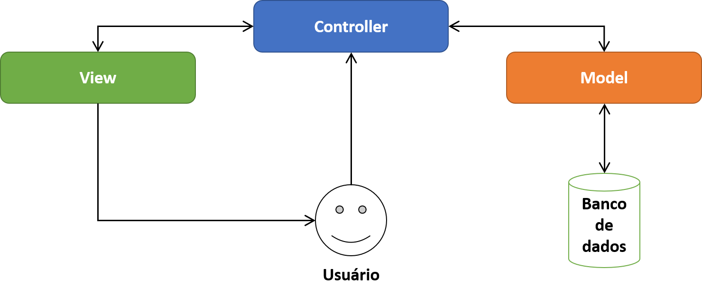

# Clientes Python
 Projeto de um cadastro de clientes utilizado para começar a compreender **MVC** e relembrar as estruturas básicas do Python

Considerações dessa Aula : 

# **Afinal, o que é MVC?**

O MVC é um padrão de arquitetura de software. O MVC sugere uma maneira para você pensar na divisão de responsabilidades, principalmente dentro de um software web.

O princípio básico do MVC é a divisão da aplicação em três camadas: a camada de interação do usuário (**view**), a camada de manipulação dos dados (**model**) e a camada de controle (**controller**).

Com o MVC, é possível separar o código relativo à interface do usuário das regras de negócio, o que sem dúvida traz muitas vantagens que veremos mais à frente.

# Quais os papéis de cada camada?
Quando falamos sobre o MVC, cada uma das camadas apresenta geralmente as seguintes responsabilidades:

● **Model** A responsabilidade dos models é representar o negócio. Também é responsável pelo acesso e manipulação dos dados na sua aplicação.

● **View** A view é responsável pela interface que será apresentada, mostrando as informações do model para o usuário.

● **Controller** É a camada de controle, responsável por ligar o model e a view, fazendo com que os models possam ser repassados para as views e vice-versa.

 

# Vamos a um exemplo…
Vamos utilizar o exemplo de uma página web, onde o usuário pode realizar o cadastro de clientes. Neste caso, provavelmente você teria uma classe chamada cliente.php que contém as informações do cliente que você deseja guardar (como nome, endereço, cidade, etc.). Essa classe seria o seu **model.**

Aqui, ainda poderíamos acoplar aspectos de manipulação de bancos de dados, concentrando nesta estrutura os métodos para inserir, alterar, excluir e listar os clientes a partir de uma tabela em um banco de dados.

A página HTML seria nossa **view**, que mostraria, por exemplo, a lista de usuários cadastrados ou mesmo o próprio formulário para cadastro de novos usuários.

O **controller** faz o meio de campo entre o **model** e a **view.** Ele é necessário porque as estruturas presentes com **view** não deveriam acessar diretamente os **models**, já que isso poderia criar um acoplamento entre as estruturas de apresentação e definição de negócio: é necessária uma estrutura intermediária para fazer essa ligação.

E aqui entra o **controller**, que age como uma ponte entre os dois. Você pode ter uma classe dentro do seu projeto PHP para fazer o papel de um controller, realizando a ligação entre **models** e **views.**

# O MVC e sua importância
Não dá para falar do MVC sem citar a importância que ele traz em meio ao desenvolvimento de software.

Uma dessas vantagens é que ele nos ajuda a deixar o código mais manutenível, ou seja, mais fácil de fazer manutenção, já que temos as responsabilidades devidamente separadas. Isso também traz uma facilidade na compreensão do código, além da sua reutilização.

Além disso, você tem um código mais testável, pois ele é mais granular: se você tem uma aplicação onde, por exemplo, na página de listagem de usuários, o nome do usuário está sendo cortado ou não está sendo exibido da maneira correta, é muito mais fácil você fazer um teste que atinja somente as estruturas de **views.**

Aqui, podemos ver claramente que você tem um problema de apresentação: os **models** não são responsáveis por aspectos de apresentação, assim como os **controllers** também não são… Veja que é até mais fácil de identificar que o problema está na **view.** Por isso, você consegue corrigir somente a **view** e testá-la de maneira isolada.

Um segundo exemplo seria se você tivesse um problema de validação ou uma informação de um campo que o usuário está preenchendo na **view** e não está chegando no banco de dados: não é a **view** que envia coisas para o banco de dados, assim como também não é o **model** que é responsável por esse papel (aliás, o **model** pode até enviar coisas para o banco de dados, mas essas informações são repassadas por outras estruturas anteriores).

Então, podemos chegar à conclusão de que o problema é no **controller.** Sendo assim, você consegue trabalhar somente no **controller,** sabendo que as alterações provavelmente não irão impactar nas **views** e nos **models.** Além disso, você conseguirá realizar testes de uma maneira muito mais rápida e eficiente.

# Considerações finais…
Por conta dessas facilidades que o MVC oferece, ele passou a ser adotado por diversos frameworks. Além disso, o MVC pode ser utilizado em diversos tipos de projetos, se tornando muito popular no desenvolvimento web, embora você também pode criar uma aplicação MVC para outras plataformas, como desktop ou mobile.

Caso você tenha dúvida se pode utilizar o MVC em qualquer linguagem de programação, a resposta é sim: isso porque o MVC não é um conceito de linguagem de programação, e sim um conceito de arquitetura. Você não tem uma linguagem que suporte isso ou não: basta você seguir os princípios da arquitetura, que estão mais focados em separar as responsabilidades das coisas do que na tecnologia em si.

É importante que todo desenvolvedor tenha conhecimento sobre o MVC, pois ele é amplamente utilizado e difundido pelo mercado. Também é interessante conhecer outros patterns baseados no MVC e que são utilizados com frequência no mercado, como o MVVM e o MVP.